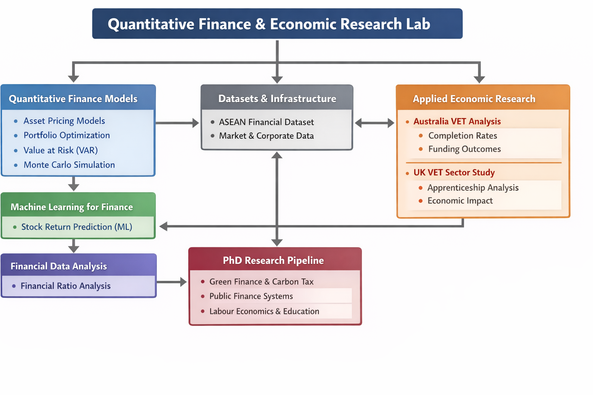

# Chi Nguyen | Quantitative Finance & Economic Research 🇱🇻 🇦🇺

Financial analyst and quantitative researcher working at the intersection of **financial markets**, **data science**, and **applied economic research**. I build reproducible financial models, empirical datasets, and research pipelines using modern quantitative tools.

---

### 🔬 Research Lab Focus
This GitHub portfolio functions as a **Quantitative Finance & Economic Research Lab**, covering:
* **Quantitative Finance:** Equity market signals and stochastic modeling.
* **Financial Risk Modeling:** Portfolio risk metrics and simulation.
* **Applied Economic Data Research:** Labour economics and VET sector efficiency.

### 🛠 Technical Stack & Methods
* **Tools:** Python (Pandas, NumPy, Scikit-learn, Statsmodels), SQL, Jupyter Notebook.
* **Methods:** Financial Econometrics, Machine Learning, Time Series Analysis, Statistical Modeling.

---

### 📈 Quantitative Finance Research

#### 🤖 Stock Return Prediction (Machine Learning)
Machine learning models evaluating predictive signals in equity markets using historical financial indicators.

#### ⚖️ Portfolio Optimization
Implementation of Modern Portfolio Theory to construct efficient portfolios under risk-return constraints.

#### 📊 Asset Pricing Models
Empirical implementation of CAPM and multi-factor asset pricing models.

#### 🎲 Monte Carlo Stock Simulation
Simulation of stock price dynamics using stochastic processes.

#### 🛡️ Value at Risk (VaR) Analysis
Risk modeling for financial portfolios using historical and parametric methods.

---

### 📂 Financial Data Infrastructure & Applied Research

* **Financial Ratio Analysis:** Automated pipeline for fundamental analysis of corporate financial statements.
* **ASEAN Financial Market Dataset:** 20-year dataset exploring volatility patterns and macro-financial dynamics.
* **Australia VET Completion Rate Analysis:** Empirical analysis of funding efficiency and labour market outcomes.
* **UK Apprenticeship / VET Sector Analysis:** Data-driven research on earnings returns and policy implications.

---

### 🎓 PhD Research Pipeline
* **Green Finance:** Quantitative assessment of carbon taxation effects on corporate financial performance.
* **Fiscal Risk in Public Systems:** Efficiency of funding and economic outcomes in education systems.
* **Labour Economics:** Empirical research on apprenticeship programs and labour market transitions.

---

### 🏗 Research Architecture
```text
quant-research-lab
│
├── financial-models
│   ├── asset-pricing-factor-model
│   ├── portfolio-optimization
│   ├── value-at-risk-analysis
│   └── monte-carlo-stock-simulation
│
├── machine-learning-finance
│   └── stock-return-prediction-ml
│
├── financial-data-analysis
│   └── financial-ratio-analysis
│
├── economic-data-research
│   ├── australia-vet-completion-analysis
│   └── uk-apprenticeship-vet-analysis
│
└── datasets
    └── asean-financial-volatility




---

### 📌 Pinned Repositories

* **stock-return-prediction-ml**
* **portfolio-optimization**
* **asset-pricing-factor-model**
* **value-at-risk-analysis**
* **monte-carlo-stock-simulation**
* **financial-ratio-analysis**
* **australia-vet-completion-analysis**
* **uk-apprenticeship-vet-analysis**

---

--

**### 💡 Research Philosophy**

Financial markets and economic systems are complex, data-rich environments.
Through rigorous quantitative analysis and transparent data pipelines, we can transform theoretical frameworks into practical, actionable insights.

---

### Collaboration

Open to collaboration in:

Quantitative Finance
Financial Data Science
Applied Economic Research
Economic Policy & Labour Economics

